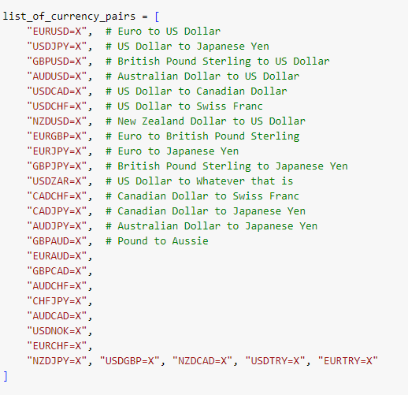

# Project Forex Helper

## Description:
This is the forex helper, with hundreds of pairs to choose from scrolling though tonnes and tonnes of charts is boring,
I've created a quick over view of the markets to give some heads up as to which charts you will want to be looking at.

It's useful for beginners to locate trending stocks, if somethings going sideways no one wants to jump in, if it's trending up across
all timeframes then you get a better idea of the general direction.

## Installation:

Uses requests, pandas and yfinance. I will add a requirements.txt file soon but any level of install will work.

## Usage:

If you want to see more pairs feel free to ask or download and add the ones in you want. There is no need to change any code at the time
of writing. Run each cell as you go and the two dataframes at the end will show you which trade pairs are trending up and the bottom one is trending down.

## Features:
Ease of use, mathematical certaintiy to accurately show the slope of a graph.

## Contributing:
If there are any issues please submit a request and i will have a look for you.

## License:
Free to use and modify, just credit me if im your orignal source
